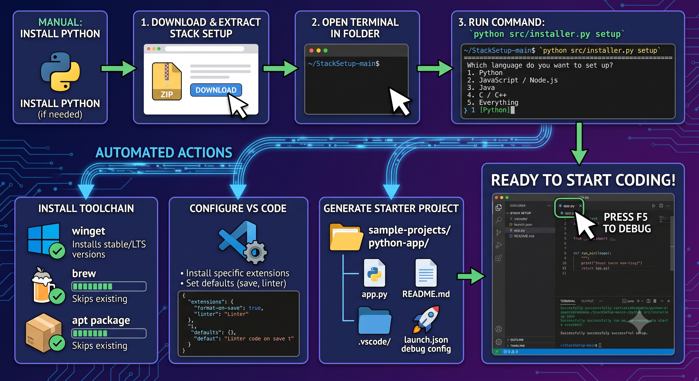

# Dev Environment Enabler
 
## What this project is about

This project is a **cross-platform CLI tool** that helps new developers set up a coding environment quickly.

Instead of manually installing everything one by one, the CLI can:
- install core tools (VS Code, Python, Java, C/C++, Node.js)
- configure VS Code with useful extensions and settings
- generate starter sample projects you can run immediately

The main goal is to reduce setup time and remove confusion for beginners.

---

## The big idea in simple words

When someone joins a project, they often ask:
- Which tools do I need?
- Which versions should I install?
- Which VS Code extensions should I use?
- How do I know my environment works?

This tool answers those questions with one workflow:
1. Choose a profile (python/web/java/cpp/fullstack)
2. Run setup command
3. Let the script install, configure, and create examples

---

## Project structure (what is where)

- `src/installer.py`
  - Main CLI entrypoint (commands users run)
  - Profile definitions (what each profile installs)
  - Package + extension mappings
  - Setup workflow orchestration
  - Sample project generation

- `src/utils.py`
  - Reusable helper functions
  - OS detection and package manager detection
  - Command execution wrapper
  - VS Code settings path resolution
  - JSON settings merge and safe file writes

- `generated-samples/` and `generated-samples-dry/`
  - Output folders created during command tests
  - Contain starter apps for selected profile languages

---

## Why these technical decisions were made

### 1) Python + Typer for the CLI
**Decision:** Use Python with the Typer library.

**Why:**
- Easy to read and maintain
- Fast to build command-based tools
- Type hints and command help are built in
- Good fit for automation scripting

### 2) Profile-based setup
**Decision:** Support profiles: `base`, `python`, `web`, `java`, `cpp`, `fullstack`.

**Why:**
- New users think in roles/stacks, not package names
- One profile command can install a meaningful group of tools
- Easier to extend later (add new profiles)

### 3) OS-aware package manager strategy
**Decision:** Detect OS and available package manager first, then map each tool to the correct package name.

**Why:**
- Package names differ by platform and manager
- Keeps one CLI command usable across Windows/macOS/Linux
- Avoids hardcoding one OS-specific flow

### 4) Separate tool installation from VS Code configuration
**Decision:** Keep installation and editor setup as separate internal steps and commands.

**Why:**
- Better modularity (install only, configure only, or full setup)
- Easier debugging when one step fails
- More flexible for future CI automation

### 5) Dry-run mode
**Decision:** Add `--dry-run` option for installation/configuration commands.

**Why:**
- Lets users preview actions safely
- Useful in demos and onboarding docs
- Reduces risk before making system changes

### 6) Generate starter projects automatically
**Decision:** Create simple runnable sample projects for installed stacks.

**Why:**
- Confirms environment works right away
- Gives beginners a known-good starting point
- Reduces “it installed but what now?” confusion

### 7) Non-destructive file writes for samples
**Decision:** Sample file helper does not overwrite existing files by default.

**Why:**
- Prevents accidental data loss
- Safer for repeated runs

### 8) Enum-based profile options
**Decision:** Use `Enum` for profile CLI options.

**Why:**
- Works reliably with the current Typer version in this environment
- Gives safer, validated inputs

---



## Commands you can run

From the `src` folder:

```bash
python installer.py --help
python installer.py profiles
python installer.py install --profile fullstack --dry-run
python installer.py configure-vscode --profile python --dry-run
python installer.py init-samples --profile fullstack --output-dir "..\\sample-projects"
python installer.py setup --profile fullstack --dry-run --output-dir "..\\sample-projects"
```

For real installation, remove `--dry-run`.

---

## What each command does

- `profiles`
  - Lists available environment profiles.

- `install`
  - Installs profile components using detected package manager.

- `configure-vscode`
  - Installs profile-specific VS Code extensions.
  - Applies default editor settings (when not in dry-run).

- `init-samples`
  - Creates starter apps for languages in the selected profile.

- `setup`
  - End-to-end workflow (install + VS Code config + sample generation).

---

## Current scope vs future scope

### Current scope (MVP)
- Cross-platform package-manager-aware install flow
- VS Code extension + settings automation
- Profile-based setup
- Starter project generation
- Dry-run safety mode

### Good next improvements
- Add dependency detection from project files (`package.json`, `requirements.txt`, `pom.xml`)
- Add tool/version verification and health checks
- Add rollback/cleanup on failed install
- Add custom profile config file support
- Add automated tests for mapping and command behavior

---

## How to read this code to catch up quickly

1. Start in `src/installer.py`:
   - Look at `PROFILE_TO_COMPONENTS`, `PACKAGE_MAP`, `PROFILE_EXTENSIONS`
   - Then read commands in order: `profiles`, `install`, `configure-vscode`, `init-samples`, `setup`

2. Move to `src/utils.py`:
   - Understand OS and package manager detection
   - Understand how commands are built and executed
   - Understand how VS Code settings are merged safely

3. Run a dry-run command and compare output with code flow:
   - This makes architecture very clear in practice

---

## Important practical notes

- Some Linux package names or repositories may need adjustment depending on distro setup.
- VS Code extension install requires `code` CLI available in PATH.
- System package installation may require admin/sudo permissions.

---

## One-sentence summary

This project is an onboarding automation tool: it turns manual environment setup into a repeatable, profile-driven CLI workflow that installs tools, configures VS Code, and creates runnable starter projects.